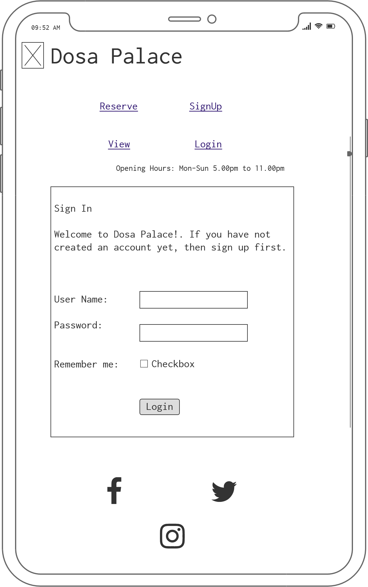

# Dosa Palace
   

## Types of Content
- [Introduction](#introduction "Goto Indroduction")
    - [Home](#home "Goto Home section")
  - [Meals](#meals "Goto Meals")
    - [Meal-details](#meal-details "Goto Meal-detail")
  - [Reservation](#reservation "Goto Reservation")
    - [Reserve](#reserve "Goto Reserve")
    - [View](#view "Goto View")
    - [SignUp](#signup "Goto Signup")
    - [Login](#login "Goto Login")
    - [Logout](#logout "Goto Logout")
  - [Contact-Us](#contact-us "Goto Contact-Us")
    - [Thanks-Msg](#thanks-msg "Goto Thanks-Msg")
- [Strategy](#strategy "Goto Strategy")   
  - [UX](#ux "Goto UX")
    
  - [Business Vision](#business-vision "Goto Business Vision")
  - [Purpose of Website](#purpose-of-website)
- [Scope](#scope "Goto Scope")
   - [Features](#features)
   - [Future Features](#future-features)
- [Structure](#structure "Goto Structure")
  - [Wireframes](#wireframes)
  - [Database Schema](#database-schema)
  - [Colours](#colours)
  - [Typography](#typography)
- [Technologies Used](#technologies-used)
- [Testing](#testing)
  - [Automation Testing](#automation-testing)
  - [Code Validation](#code-validation)
  - [Features Testing](#features-testing)
  
- [Bugs](#bugs)
- [Deployment](#deployment)
- [Acknowledgement](#acknowledgement)

## Introduction
- This project will cover about the Restaurant,Meal list,Meal details, Reserve the table,Edit and delete the reservation options and contact information of the restaurant.

- The webpage is categorised into four main sections, such us Home, Meals, Restaurant and ContactUs.
- Finally Thanks message is displayed after submitting the Enquiry form.
- when the user click the reservation navigation the webpage navigation changes to three categaries such us Home, Reserve and View.

- The website covers all the screen types, such as Pc,Laptop,Tablet and Mobile.
- There is Login Page in the website. The customer has to login in to website using username and password before making any Reservation.
### Home
  The Home Page covers the foloowing sections:
- Header, Logo Navigation Menu and operationg time of the restaurant.
- Hero-image
- About the restaurant
- Gallery
- Contact details - Address, Email and Phone Number.
- Footer
- [Home-Ipad-1](assets/images/home-ipad-1.PNG)
- [Home-Ipad-2](assets/images/home-ipad-2.PNG)
- [Home-Ipad-3](assets/images/home-ipad-3.PNG)
- [Home-Ipad-4](assets/images/home-ipad-4.PNG)

### Meals
  Meals Page covers the following sections:
- Header, footer, contact details and Hero image similar like Home page.
- Meal list 
- Meal details click button.
- [Meals-Ipad-1](assets/images/home-ipad-1.PNG)
- [Meals-2](assets/images/meals-1.PNG)
- [Meals-Ipad-3](assets/images/home-ipad-4.PNG)

### Meal details
  Meal details page covers the following sections:
- Header, footer and contact details
- Image of the Meal
- Meal Name
- Meal description
- Meal price in Euros
- Preparation time in Minutes.
- Back to Meals button
- [Meals-Details-1](assets/images/meal-details-ipod-1.PNG)
- [Meals-Details-2](assets/images/home-ipad-4.PNG)

### Reservation
  Reservation page allows two options.
- Header and Footer
- New user to register their details before login.
- old customer can login with their username and password.
- [Reservation / SignUp-1](assets/images/reservation-1.PNG)

#### Reserve
  Reservation table contains the following informations:
- Header and Footer for reserve, view and Edit pages.
- Username(username is default to login username)
- Name (Can be used for themself or others)
- Phone Number(must be 10digit)
- People (Number of people to reserve the table)
- Date (can pick in the calender)
- Time (24 hours clock time)
- [Reserve-Mobile page-1](assets/images/reserve-mobile-1.PNG)
- [Reserve-Mobile-page-2](assets/images/reserve-mobile-2.PNG)

#### View
  In the view page, the customer details are displayed as per the reservation. Two other additional buttons are available in the view page. The two buttons are Edit and Delete.
- [View-Mobile](assets/images/view-mobile-1.PNG)

##### Edit button
  Allowing the customer to update their name, phone number,no of people, date and time.
- [Edit Page](assets/images/edit-1.PNG)

##### Delete button
  Allowing the customer to delete their reservation. when the customer choose the delete button, the confirmation popup message will appear to confirm the delete option.
- [Delete- Modal-Ipod](assets/images/delete-modal-1.PNG)

#### Signup
  Registration page contains:
- Header and Footer
- Username (It is not case sensitive)
- Email (optional)
- Password (It is not case sensitive)
- Confirm password
- Signup button
- [Reservation / SignUp-1](assets/images/reservation-1.PNG)

#### Login
  Login Page contains:
- Username
- Password
- Remember me with checkbox
- Sign in button
- [Login](assets/images/login-mobile.PNG)

#### Logout
- Header and Footer
- Sign out button
- [Logout](assets/images/logout-mobile.PNG)

### Contact-Us
  Contact us page contains the Following details:
- Header and Footer
- Name to enter
- Email address to Enter
- Message box for brief comments or enquiries
- send button
- [Contact Us- Desktop-1](assets/images/contact-us-desktop.PNG)
- [contact Us-Ipad-2](assets/images/home-ipad-4.PNG)

#### Thanks-Msg
  Once click on the send button in the contact page, it will navigate in to Thank you message page. 
  It contains:
- Header and Footer
- Image of the dosa
- Thanks message
- [Thanks Message-Desktop](assets/images/thanks-msg-desktop.PNG)

## Strategy
  The website covers all the screen types, such as Pc, Laptop, Tablet and Mobile. The website is easily navigate to all the sections.
  Attract the local community to taste South Indian Cuisine. Variety of dosas are available in the restaurant.

### UX

#### UserStory using Kanban feature in Agile Methodology
  These are the steps for UX 
1. Click Projects in the dosa palace repositary and Create a Project name.
2. Then select, Project Template => Basic Kanban => create Project.
3. In the ToDo column, there will be three cards, delete those cards.
4. In the Todo column click three dots, then click =>  manage automation => click newly added box => update automation.
5. Then click => issues => new issues => Get started.
6. Then start to write Title and UX. 

- As a Site User I can view the service options available in the Restaurant's Home page so that I can select the service that is required.
- As a Site User I can click the Contact option so that I can view the Contact information of the restaurant.
- As a Site User I can view all the meals provided in the Restaurant so that I know what the meals are available in the Restaurant.
- As a Site User I can click the Meal option so that I can view the details of the meal.
- As a Site User I can click the Back to Meals option so that i can return back to the Meals list.
- As a Site User I can click the Reservation option so that I can reserve the Table for dining.
- As a Site User I can register my details so that I can Login.
- As a Site User I can select the Login option so that i can reserve the table for dining.
- As a Site User I can select the Logout the option so that I can logout safely from the website.
- As a Site User I can click the view Reservation option so that I can view the reservation for dining.
- As a Site User I can select the Edit option so that i can edit information provided earlier.
- As a Site User I can select the Delete option so that I can Delete the Reservation.
- As a Site User I can use the contact option so that I can make enquiries regarding my dining requirements.

### Business Vision
  There is no Indian restaurant around this area at 10km radius. Dosa is suitable for all age groups. This cuisine is not spicy which is suitable for local community. The ingredients are available locally to prepare this cuisine. We could easily compete with other local restaurants and stalls.

### Purpose of Website
  To promote the dosa cuisine to the local community. The website describes various types of dosa available.It also provides the option to reserve table or walk in Dining.

## Scope
  The website covers details of the restaurant, list of dosas, dosa details, customer reservation and contact option.

### Features
- Meal list - User can view the variety of Dosa
- Meal details - List of detailed information of the meal
- Reservation - Customer to make reservation for dining in the restaurant.
- Register,login and logout - Customer can register or login to reserve the table. Customer can logout after reserving the table.
- edit and delete button - user can use edit button to update their details if they want. Delete button can used if they want to delete the reservation.
- contact form - its used for the customer  to contact the restaurant.

### Future Features
1. Currently the booking is reset manually in the admin page. In future i like to automate this operation.
2. Currently the table number reservation is done by restaurant people, i like to automate the table number booking through online.
3. I like to bring food delivery in the future.

## Structure
  This project is divided into four main pages. The website was better organised after my mentoring session with my mentor. The website was structured such a way that the users can navigate to find relevant information according to their need.

### Wireframes
Balsamiq Wireframes used for this website.

Home

Meals

Meal-Details

Reservation / SignUp

Reserve

View

Edit

Delete-Modal box

Login

Logout

Contact Us

Thanks Message

#### Balsamiq wireFrames for Mobile Phones:

Home Mobile

Meals Mobile

Meal-Details Mobile

Reservation / Signup Mobile

Reserve Mobile

View Mobile

Edit Mobile

Delete-Modal box Mobile

Login Mobile

Logout Mobile

Contact Us Mobile

Thanks Message Mobile

### Database Schema
db diagram used for this website.

### colors
I have used warm light and dark colours to create pleasant experience for those people to viewing this website. colors used:

Bootstrap colour also used for this website.
- bg-info
- bg-light
- bg-dark
- bg-success
- #008000
- #0000ff
- #e0f0f5
- #d3d3d3
- #fff
- #000

### Typography
I have used Open Sans, cursive and 'Raleway', sans-serif to create this website.

## Technologies Used
### Language
- HTML - used for to create the website.

- CSS - used for style the website.

- Python - used for Reserve a table. and allows users to interact with web pages.
- Java Script -used for Delete button Modal, Calender for add reservation and emailjs.

### Libraries & Frameworks
- Django Web Application Framework
- Bootstrap - for responsive website
- Font Awesome - icons used throughout the site. Responsive design - To generate the mockup image.
- Google font -used for the website looks more beautiful,fast and great typography

#### Tools
- Gitpod - is an open source platform for automated and ready-to-code.
- Github - to save the project code and host the live project.
- Python Tutor - to check how the Java Script code behaves in each line.
Dev tools -For inspecting and editing the web code.
- Heroku - To Deploy the Project.
- allauth - for site user Signup, login and logout of account.
- Cloudinary - To save images from admin page.
- favicon - for generating 32x32 favicon.
- Am I responsive - to check  the responsive pages.
- Balsamiq - to create wireframes.
- dbdiagram.io - to create database schema

## Testing

### Automation Testing
I used automated python Unittest to test models.py, views.py and forms.py.
I attached the results for Python Unittest.

### Code validation
- W3 Markup Validation Service- To validate HTML document, i used Validate by direct URL, some errors shown, and then i fixed the errors. W3 HTML Validation Result:
Document checking completed. No errors or warnings to show.
- W3 CSS Validation Service- To validate HTML document, i used validate by direct input, no errors shown in the W3 validation page. W3 CSS validation Result: Congratulations! No Error Found.
- pep8 Online Validator- To validate python document, i used validate by direct input, no errors shown pep8 online validator.

### Features Testing
1. #### Home Page
    There are 11 testCases in Home Page.
- There are 7 testcases in  header section  which are Dosapalace, Home, Meals, Reservation, Contact-Us, signup and Login. 
Dosa Palace heading and Home Navigation are designed to bring the user back to the home page.Testing also proves that these options worked as per design. The other navigations are designed to bring the user to the website.Testing proves that these options worked as per designs. 
- [Header-Testing](assets/images/header.PNG)
- There is 1 Testcase in middle of the Hero image. If the user click the Book a table Today option it will navigate to Reservation page. Testing proves that this option worked as per design. 
- [Hero-image-Testing](assets/images/hero-image.PNG)
- There are three Social media links attached in all other pages.These social media navigators worked as per design requirements.For example, when click the Facebook button it brings to the Facebook main page. 
- [Footer-Testing](assets/images/home-ipad-4.PNG)

2. #### Meals Page
    There are 8 menus are available. If they click on each menu meal details button it will navigate to that particular meal details. The testing proves that each meal option navigates to each meal detail page. 
- [Meals-Testing](assets/images/meals-1.PNG)

#### Meal details
    There are 1 back button is available. If they click the back to meals button it will go back to Meals list section.The testing proves that the back button works properly. 
- [Meals-Details](assets/images/meal-details-ipod-1.PNG)

3. #### Reservation Page
    Header Navigation bar changes when the user click Reservation Page. There are 2 new navigation bar and 1 signup button. The testcases prove that the 2 new navigation bar and 1 new signup button are working as per design. 
- [Reservation / SignUp-Testing](assets/images/reservation-1.PNG)

4. #### Login page
    There is 1 testcase in Login Page such as Sign In Button. The testing proves that this button working as per design. 
- [Login-Testing](assets/images/login-mobile.PNG)

5. #### Logout Page
    There is 1 testcase in Logout Page such as Sign Out button. The testing proves that this button working as per design. 
- [Logout-Testing](assets/images/logout-mobile.PNG)

6. #### Reserve Page
    There is 1 testcase in Reserve page such as Reserve a Table button. The button is called the Reserve a Table. I did validation in the Reservtion page. 
- [Reserve-Testing](assets/images/reserve-mobile-2.PNG)

#### Validation:
1.  Username - The Username is default which is taken from the Login page Username.
2. Name - The user can reserve the dining table option either for themself or others. The user must enter the name parameter, if the name parameter is not updated an error message will appear to remaind that the user must enter the name.The name parameter is tested and it works as per design.
- [Name-Validation](assets/images/name.PNG)
3. Phone Number - The user must enter 10digit phone number in the phone field. it works as per design.
- [Phone Number-Validation](assets/images/phone.PNG)
- [Phone Number1-Validation](assets/images/phone1.PNG)
4. People - The user must enter only numbers maximum two digit numbers. The testing proves that it works as per design.
- [Number of People-Validation](assets/images/people.PNG)
- [Number of People1-Validation](assets/images/people1.PNG)
5. Date - The user can choose date in the calender. It only allows current and future Date only. The testing proves that it works as per design.
- [Date-Validation](assets/images/date.PNG)
6. Time - The user is allowed to book between 17:00 to 22:30 hours only. The testing proves that it works as per design.
- [Time-Validation](assets/images/time.PNG)
7. When the user enters name and the booking date the system will compare these parameters with the existing booking list. if the name and date are same the system will feedback the error message stating "Booking already Exist".
- [Double Booking-Message](assets/images/double_booking.PNG)

7. #### View Page
    There is 2 testcases for each reservation option in view page such as Edit and Delete Button.Both are working as per design. 
- [View-Testing](assets/images/view-mobile-1.PNG)
- When the booking is successful the success message will appear in the view page.
- [Success-Message](assets/images/success_msg.PNG)

8. #### Edit Page
    There is 1 testcase in Edit button such as Update button.User can edit Name, Phone number, number of people, date and time. But they cant edit username. This function proved as per design. 
- [Edit-Testing](assets/images/edit-1.PNG)

9. #### Delete Modal confirm box
    There is 2 testcases in Delete Modal confirm box such as yes or no for delete option.
- Yes to Delete - Proved
- No to navigate to view page -Proved
- [Delete-Testing](assets/images/delete-modal-1.PNG)
- The user delete the reservation, cancellation message will appear in the view page.
- [Cancellation-Message](assets/images/cancel_msg.PNG)

10. #### Contact-Us Page
    There is one testcase in contact us page such as Send button. It is working as per design. 
- [Contact Us-Testing](assets/images/contact-us-desktop.PNG)
#### Validation:
1. Name: The user must enter the name parameter, if the name parameter is not updated an error message will appear to remaind that the user must enter the name.The name parameter is tested and it works as per design.
- [Name-Validation](assets/images/name_contact.PNG)

2. Email Address: The user must enter the Email address, if the email parameter is not updated an error message will appear to remaind that the user must enter the email address.The email address parameter is tested and it works as per design.
- [Email-Validation](assets/images/email_contact.PNG)
- [Email1-Validation](assets/images/email_contact1.PNG)
3. Message: Enquiries must enter the message box. If the message box is not updated an error message will appear to remaind that the user must enter the message box.The Message is tested and it works as per design.
- [Message-Validation](assets/images/message_contact.PNG)

### Bugs
1. I have alot of difficulties to change sqlite to postgres in Heroku. With the help of tutor support i manage to resolve the problem.
2. When i updated the model, the change did not update in the Heroku, With the help of tutor support i manage to resolve the problem by resetting postgres in Heroku.
3. I have difficulties in understanding  how to render the templates. Manage to resolve the problem by reviewing the walkthroughs multiple times.

## Deployment
  First we need to go to github website to create a new repositary using code Institute Template. Followed by giving a new name of the website.Then need to click the create repositary button. After click the button it will bring us to go to another page, which contains the green button labelled as Gitpod.Click the Gitpod button will bring us to the Gitpod Workspace for coding screen.

### gitpod
  Used Gitpod Workspace for coding. To preview the browser window need to type "python3 manage.py runserver" in the terminal window at the bottom.Afterthat, have to do git add for add files or remove files and do git commit for reasoning and do the git push for git hub repositary website.

### Procedure for First empty Deployment
1. First install the Django and gunicorn in the terminal => pip3 install django gunicorn  (Gunicon is the server that we're  going to use to run Django on Heroku.)
2. next install supporting libraries:
- pip3 install dj_database_url psycopg2
- pip3 install dj3-cloudinary-storage
3. Requirement.txt file 
- pip3 freeze --local > requirements.txt
4. Create a new project name:
- django-admin startproject dosaproject .
5. Create a new app name:
- python3 manage.py startapp meals
6. Then enter the app name("meals",) in to the INSTALLED_APPS in settings.py
7. Then in the terminal run Migrate changes:
- python3 manage.py migrate
8. Then run the server:
- python3 manage.py runserver (we can see the installation work successfully in the browser).

### Heroku
1. Create new app name and select europe.
2. Then Click => Resources Tab => Addons  enter=> Postgres, then select => Heroku postgres => Hobby dev.
3. Then select the settings tab, click Reveal Config Vars and then copy the Database Value.
### Then again in the workspace
1. Create env.py file in the root directory.
Inside the env.py file
- import os
- then enter os.environ["DATABASE_URL"] = PASTE THE URL FROM HEROKU CONFIG VAR DATABASE_URL WITH STRING.
- then os.environ["SECRET_KEY"] = "SECRET_KEY"
- then copy the secret key value and paste this in  Heroku Reveal config var section in settings tab  without string.

2. Then settings.py
- import os
- import dj_database_url
- if os.path.isfile("env.py"): 
	import env
- In SECRET_KEY section remove the value is placed then add like this: 
SECRET_KEY = os.environ.get('SECRET_KEY')
- then DATABASES COMMENT OUT ALL (just highlight all of it.
And then, comment out the entire section. 
Press control forward slash on a PC or command forward slash on a Mac to do that.)
- ADD new section like this: 
DATABASES = {
		'default': dj_database_url.parse(os.environ.get('DATABASE_URL'))
}
3. Then again enter migration command in the terminal  ==> python3 manage.py migrate
4. Create the Cloudinary Account and then copy the Cloudinary Api, Paste in the env.py file and heroku Reveal config vars. After this  add 'cloudinary_storage',
'cloudinary', in to the INSTALLED_APPS in settings.py.
5. Then add templates in TEMPLATES_DIR in settings.py.
6. Then ALLOWED_HOST needs to be:
- ALLOWED_HOSTS = ['dosa-palace.herokuapp.com', 'localhost']
7. Then Create Procfile, inside the Procfile just enter
- web: gunicorn dosaproject.wsgi:application
8. Then in the terminal:
- git add .
- git commit -m "Deploy Commit"
- git push
9. Then Go heroku app select deploy tab connect the Github and then select Manual deploy. it will create the app run successfully.

### Final deployment:
  After finish the project then need to do the following steps:
1. Debug= False in settings.py
2. git add .
git commit -m "deployment commit"
git push
3. heroku setting remove DISABLE_COLLECTSTATIC
4. Then Deploy and can view the App in Heroku.

## Acknowledgement

- I would like to thank my mentor Rohit Sharma and my tutors Kasia for their helpfulness, constructive feedback and guidance when needed.
- I would like to thank the staff,students and my peers of Code Institute for their help.
- I also like to thank Slack Community for sharing the open discussion from various students.
- I search lots of information from Google, W3 School and Youtube for this project.
- Thanks for reading my README.md file.

